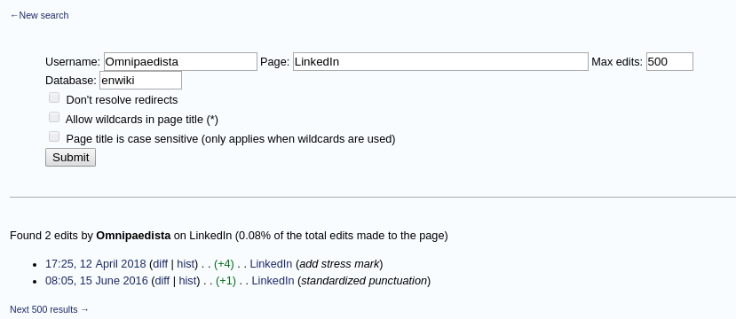

下载解压gobblin之后，运行`bin/gobblin run`会看到用法示例。
```
2018-04-19 08:26:48 INFO  Reflections - Reflections took 878 ms to scan 43 urls, producing 645 keys and 2317 values 
Command line parse exception: Missing required option: jobName
usage: gobblin run [listQuickApps] [<quick-app>] -jobName <jobName>
               [OPTIONS]
 -jobName <arg>
 -distributeJar <arg>
 -distributeJarByClassWithPriority <arg>
 -distributeJarWithPriority <arg>
 -enableMetrics
 -h,--help
 -jobFile <arg>
 -kerberosAuthentication <arg>             Authenticate using kerberos.
                                           Format:
                                           "<login-user>:<keytab-file>".
 -l                                        Uses log to print out erros in
                                           the base CLI code.
 -mrMode
 -setConfiguration <arg>
 -setJobTimeout <arg>
 -setLaunchTimeout <arg>
 -setShutdownTimeout <arg>
 -setTemplate <arg>
 -sysConfig <arg>
 -usePlugin <arg>
 -useStateStore <arg>
 ```
 可以看到有jobName这些的选项。
 运行`bin/gobblin run listQuickApps`可以看到有两个可选的app可以使用
```
2018-04-19 08:33:40 INFO  Reflections - Reflections took 358 ms to scan 43 urls, producing 645 keys and 2317 values 
Usage: gobblin run <quick-app-name> [OPTIONS]
Available quick apps:
	distcp	-	Distributed copy between Hadoop compatibly file systems.
	wikipedia	-	Gobblin example that downloads revisions from Wikipedia.
```
选择wikipadia,运行`bin/gobblin run wikipedia`,得到如下提示：
```
2018-04-19 08:37:01 INFO  Reflections - Reflections took 388 ms to scan 43 urls, producing 645 keys and 2317 values 
Error: Unexpected number of arguments.
usage: gobblin run wikipedia [OPTIONS] <article-title> [<article-title>
               ...]
 -avroOutput <arg>                         Write output to Avro files.
                                           Specify the output directory as
                                           argument.
 -distributeJar <arg>
 -distributeJarByClassWithPriority <arg>
 -distributeJarWithPriority <arg>
 -enableMetrics
 -h,--help
 -jobFile <arg>
 -kerberosAuthentication <arg>             Authenticate using kerberos.
                                           Format:
                                           "<login-user>:<keytab-file>".
 -l                                        Uses log to print out erros in
                                           the base CLI code.
 -lookback <arg>                           Sets the period for which
                                           articles should be pulled in
                                           ISO time format (e.g. P2D,
                                           PT1H)
 -mrMode
 -setConfiguration <arg>
 -setJobTimeout <arg>
 -setLaunchTimeout <arg>
 -setShutdownTimeout <arg>
 -setTemplate <arg>
 -sysConfig <arg>
 -usePlugin <arg>
 -useStateStore <arg>
 ```
现在运行`bin/gobblin run wikipedia -lookback P10D LinkedIn
Wikipedia:Sandbox`,得到很多东西，仔细看可以知道这个案例是获取wiki百科上面linkedin的页面修改的记录的数据。比如其中有一段返回在终端的信息如下：
```
2018-04-19 08:42:25 INFO  Fork-0 - Wrapping writer gobblin.writer.PartitionedDataWriter@6d28a96
{"revid":836097094,"parentid":835847234,"user":"Omnipaedista","userid":8524693,"timestamp":"2018-04-12T17:25:11Z","size":83666,"pageid":970755,"title":"LinkedIn"}
```
可以看到用户中有一个叫Omnipaedista的人。这样我在wikipedia里面


看到有一个`Edits by user`的选项，这样我在这里输入刚才的用户名


提交以后可以看到有两条记录


运行`bin/gobblin run wikipedia -lookback P10D -avroOutput /tmp/wikiSample`
会在`/tmp/wikiSample`目录下生成`LinkedIn`和`Wikipedia_Sandbpx`两个文件夹，并且都有一个avro文件。
我运行这里的时候出了错
```
2018-04-19 09:51:02 INFO  Reflections - Reflections took 456 ms to scan 43 urls, producing 645 keys and 2317 values 
Error: Unexpected number of arguments.
usage: gobblin run wikipedia [OPTIONS] <article-title> [<article-title>
               ...]
 -avroOutput <arg>                         Write output to Avro files.
                                           Specify the output directory as
                                           argument.
```
根据提示看是缺少参数，但我这命令是跟教程上的一样的，不知道哪里出了问题。

后面我看到了错误了，这个教程给的代码缺少了参数，这里缺少的参数是指定一个任务吧。我加上了`LinkedIn`和`Wikipedia`之后就运行成功了
```
bin/gobblin run wikipedia -lookback P10D LinkedIn Wikipedia:Sandbox -avroOutput /tmp/wikiSample
```

后面是把gobblin当做daemon(守护进程)来运行。
这里说的是，把gobblin当做守护进程来运行的话，它会在目录里寻找job配置文件(这样的文件以*.pull作为扩展名),然后如果job文件里只配置了一次运行的信息的话，那么gobblin会就按照文件描述的运行，如果这个job文件里配置了多个job信息的话，那么gobblin会自动运行job文件里所写的信息。(*Job files can be either run once or scheduled jobs. Gobblin will automatically execute this jobs as they are received following the schedule*)

每一个gobblin的job都至少包含几个结构：Source,Extractor,DataWriter和DataPublisher。
Source指的是数据的来源

Extractor指的是遵循一定的逻辑去提取出数据的记录

DataWriter定义了提取出的记录输出的方式

DataPublisher把数据打印到最后输出的位置。

一个job可选的可以含有一个或者多个转换器。这些转换器能够检查提取出来的数据记录，是否符合一定的规则。

接下来要做的demo样例与这些类相关: WikipediaSource, WikipediaExtractor, WikipediaConverter, AvroHdfsDataWriter, BaseDataPublisher。

为了能够运行standalone daemon mode我们需要gobblin配置文件(比如像[gobblin-standalone.properties](https://github.com/linkedin/gobblin/blob/master/conf/gobblin-standalone.properties)),然后每个我们需要运行的job，我们同样需要job配置文件(比如像[wikipedia.pull](https://github.com/linkedin/gobblin/blob/master/gobblin-example/src/main/resources/wikipedia.pull))

gobblin的配置文件就像命令行参数一样传递给gobblin，它里面要有一个属性jobconf.dir来指定job的配置文件存放在哪里。默认的话，jobconf会指向环境变量`GOBBLIN_JOB_CONFIG_DIR`。这样每一个后缀名为`.job`或者`.pull`的文件在jobconf.dir里，会被认为是一个job配置文件。然后gobblin会根据每一个这样的文件运行一个job。要了解更多关于standalone模式的信息的话，参考[Standalone Deployment](http://gobblin.readthedocs.io/en/latest/user-guide/Gobblin-Deployment/#Standalone-Deployment)页面

这里还有一些通常使用到的配置属性的列表:
[Configuration Properties Glossary](http://gobblin.readthedocs.io/en/latest/user-guide/Configuration-Properties-Glossary)

### 步骤
+ 新建一个文件夹存储job配置文件。把wikipadia.pull放在这个目录，并设置环境变量`GOBBLIN_JOB_CONFIG_DIR`指向这个文件夹。同时确保JAVA_HOME环境变量也是正确的。
> 这里我看到一个有用的链接[Gobblin部署--mapreduce模式](https://blog.csdn.net/lmalds/article/details/53994091)

+ 新建一个文件夹作为gobblin的工作目录,gobblin会把job的输出以及其他的一些信息写在这个目录下，比如locks和state-store(了解更多信息，查看[Standalone
  Deployment](http://gobblin.readthedocs.io/en/latest/user-guide/Gobblin-Deployment#Standalone-Deployment))，同样也是设置环境变量`GOBBLIN_WORK_DIR`指向这个文件夹。

+ 然后运行Gobblin:
```
bin/gobblin-standalone.sh start
```
这个脚本会通过gobblin配置文件[gobblin-standalone.properties](https://github.com/linkedin/gobblin/blob/master/conf/gobblin-standalone.properties)作为参数运行gobblin。

运行之后报了错误，在[这里](https://stackoverflow.com/questions/46806672/gobblin-quickstart-sample-exceptionclassnotfoundexception-org-apache-gobblin-e)找到了解决方案。

也不知道到底运行成功了没有，我看教程上的运行出来能够Extracted 20 data
records，而我刚才运行的我看日志只得到了0条。不过我在gobblin_work_dir里面看到生成了某些东西，感觉应该是成了，继续下去看看。
这里在gobblin_work_dir里面生成的东西
```
➜  gobblin_work_dir ls
job-output  locks  state-store  task-output  task-staging
```

job完成后的输出会被作为Avro文件放在`GOBBLIN_WORK_DIR/job-output`里面,要查看job输出的内容，要使用Avro
tools把Avro转换成JSON。下载最新的Avro tools(e.g. avro-tools-1.8.1.jar):
```shell
curl -O http://central.maven.org/maven2/org/apache/avro/avro-tools/1.8.1/avro-tools-1.8.1.jar
```
然后在生成的.avro文件那里运行
```shell
java -jar avro-tools-1.8.1.jar tojson --pretty [job_output].avro > output.json
```
就可以看到生成的output.json了，可能会报错找不到jar包，在上面这条命令中加上jar包路径就可以了。


这是部分output.json的信息:
```json
{
  "revid" : {
    "double" : 8.36941752E8
  },
  "pageid" : {
    "double" : 1.6283969E7
  },
  "title" : {
    "string" : "Wikipedia:Sandbox"
  },
  "user" : {
    "string" : "2001:569:7BF5:9600:1873:1CE5:D879:28B3"
  },
  "anon" : {
    "string" : ""
  },
  "userid" : {
    "double" : 0.0
  },
  "timestamp" : {
    "string" : "2018-04-17T19:35:54Z"
  },
  "size" : {
    "double" : 734.0
  },
  "contentformat" : null,
  "contentmodel" : null,
  "content" : null
}
```

注意到这里，刚才使用的job配置文件(wikipedia.pull)没有指定成一个job
schedule，所以这个job会立即运行并且只运行一次，如果要在确定的时间内或者重复地运行一个job
schedule的话，那么需要使用cron-based syntax来设置`job.schedule`属性，例如，`job.schedule=0 0/2 * * * ?`，这样这个job会每两分钟运行一次。更多细节查看[Quartz CronTrigger](http://www.quartz-scheduler.org/documentation/quartz-2.1.x/tutorials/crontrigger.html)

### 创建你自己的job
创建自己的job,只需要继承相关的接口比如[Source](https://github.com/linkedin/gobblin/blob/master/gobblin-api/src/main/java/gobblin/source/Source.java), [Extractor](https://github.com/linkedin/gobblin/blob/master/gobblin-api/src/main/java/gobblin/source/extractor/Extractor.java), [Converter](https://github.com/linkedin/gobblin/blob/master/gobblin-api/src/main/java/gobblin/converter/Converter.java), [DataWriter](https://github.com/linkedin/gobblin/blob/master/gobblin-api/src/main/java/gobblin/writer/DataWriter.java),
不过上面的这些链接都已经失效了,我自己找的链接放在下面

[Source](https://github.com/apache/incubator-gobblin/blob/master/gobblin-api/src/main/java/org/apache/gobblin/source/Source.java)

[Extractor](https://github.com/apache/incubator-gobblin/blob/master/gobblin-api/src/main/java/org/apache/gobblin/source/extractor/Extractor.java)

[Converter](https://github.com/apache/incubator-gobblin/blob/master/gobblin-api/src/main/java/org/apache/gobblin/converter/Converter.java)

[DataWriter](https://github.com/apache/incubator-gobblin/blob/master/gobblin-api/src/main/java/org/apache/gobblin/writer/DataWriter.java)

在job配置文件里面，设置属性，比如source.class和converter.class指向上面的这些类。

另外，用户可以自由的直接继承Extractor接口，Gobblin也基于一些通用的协议提供了几个Extractor的继承接口。

[RestApiExtractor](https://github.com/apache/incubator-gobblin/blob/master/gobblin-core/src/main/java/org/apache/gobblin/source/extractor/extract/restapi/RestApiExtractor.java)

[SftpExtractor](https://github.com/apache/incubator-gobblin/blob/master/gobblin-core/src/main/java/org/apache/gobblin/source/extractor/extract/sftp/SftpExtractor.java)

后面的两个找不到了，可能已经被删除了。

[KafkaExtractor](https://github.com/apache/incubator-gobblin/blob/master/gobblin-api/src/main/java/org/apache/gobblin/source/Source.java)

[JdbcExtractor](https://github.com/apache/incubator-gobblin/blob/master/gobblin-api/src/main/java/org/apache/gobblin/converter/Converter.java)


