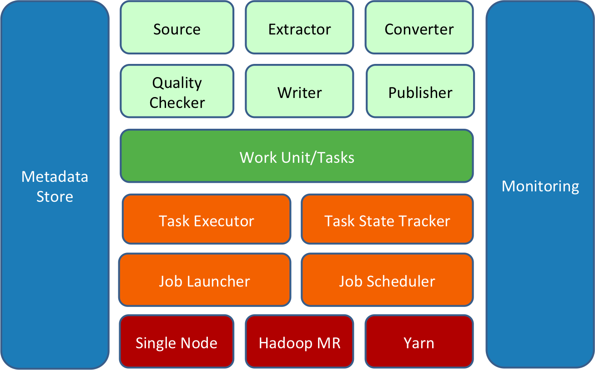
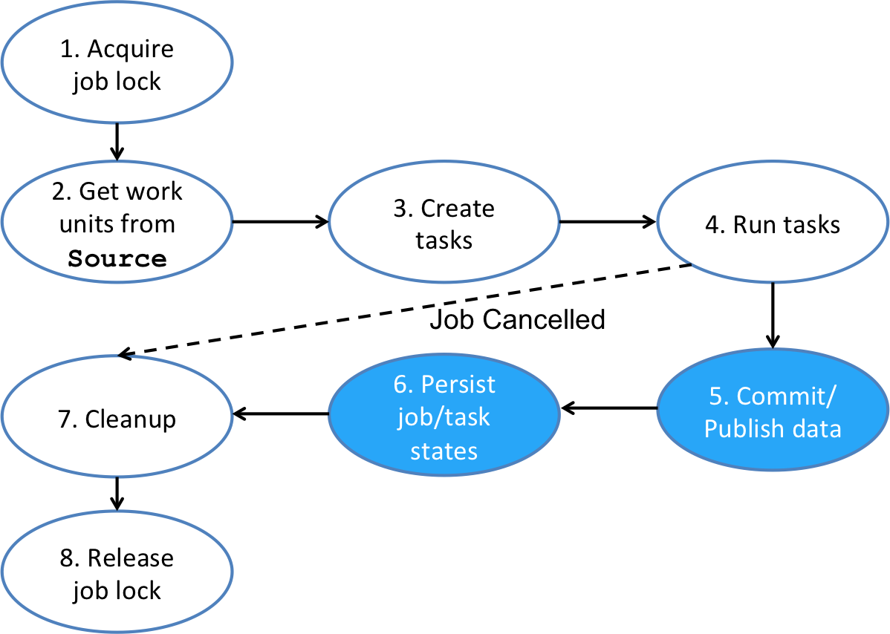
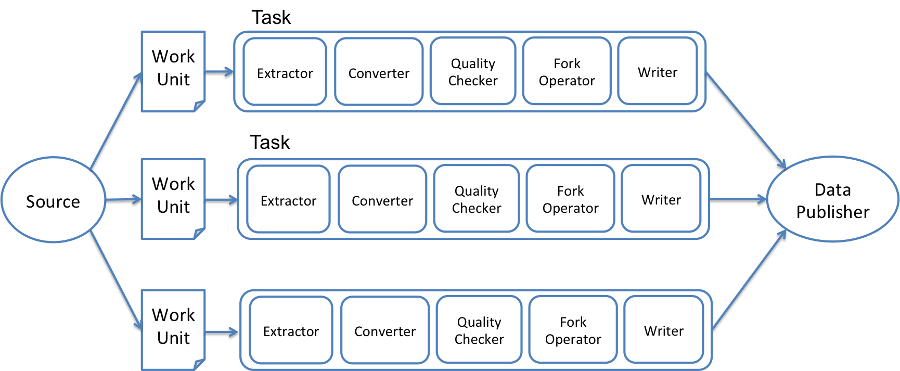
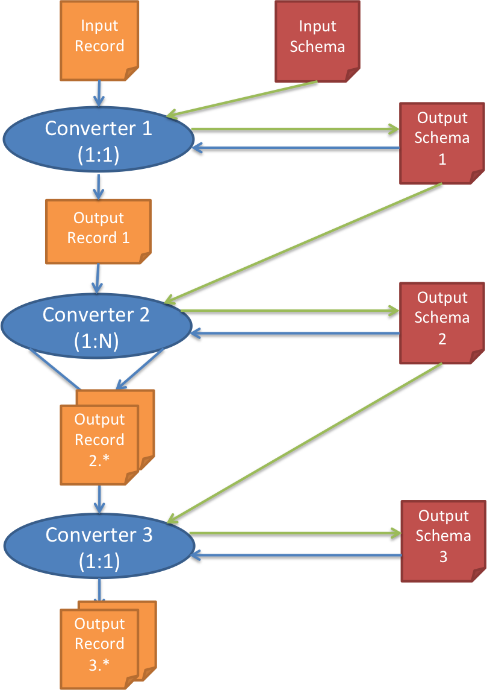
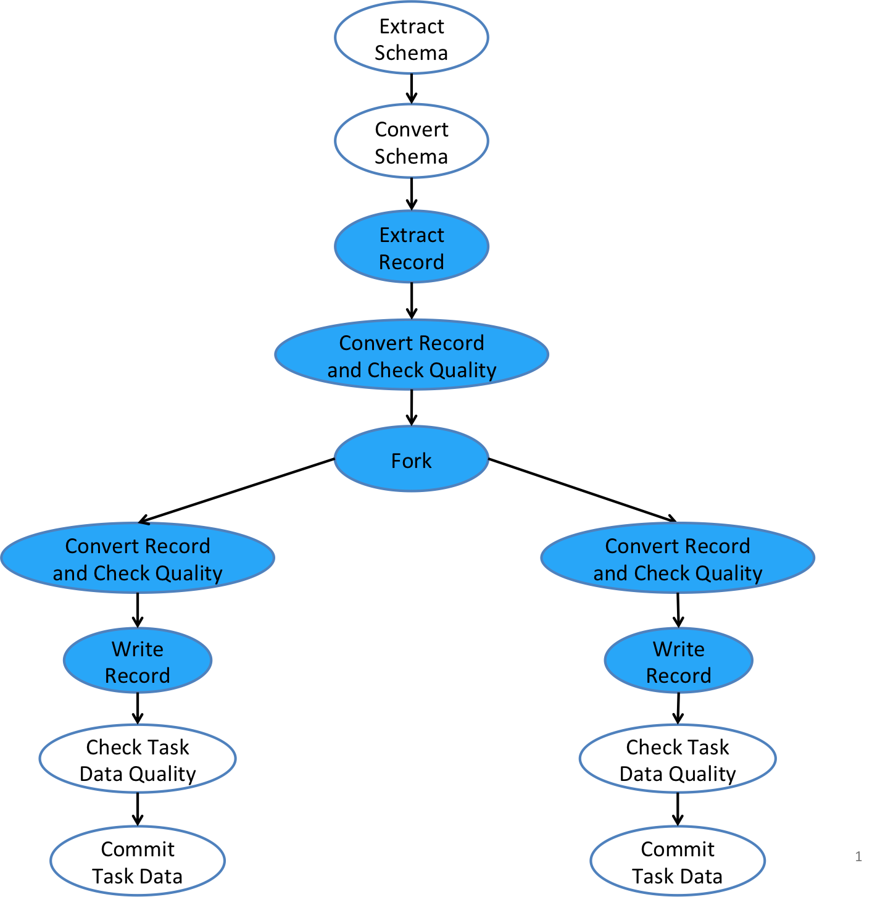

### Gobblin Architecture Overview

Gobblin的构建围绕着可扩展性展开，允许用户自定义接口去适应新的source。下面是它的结构图:

一个gobblin的job是构建在一堆构件上。(图中浅绿色的方块)它们以某种方式共同工作，来完成数据的提取。所有的这些构造可以说都是插件化的，通过在job的配置文件里面添加或者扩展已经存在的接口就可以完成这种插件化的操作。这些构件在[Gobblin
Constructs](https://gobblin.readthedocs.io/en/latest/Gobblin-Architecture#gobblin-constructs)里面会讲到。

一个gobblin的job由一堆task组成。每一个task相当于一个小的单元，然后去完成提取一部分数据的工作。
Gobblin的job的task由部署设置(上图中红色方块)的Gobblin runtime来执行(上图中的橙色方块)。

Gobblin
runtime处理很多东西，包括job和task的调度，异常的捕获还有各种管理，状态的管理，数据的质量检查，数据的打印，等等。

Gobblin目前支持两种部署模式：单节点的standalone和Hadoop集群的Hadoop MapReduce模式。现在还准备让Gobblin支持[YARN](http://hadoop.apache.org/docs/current/hadoop-yarn/hadoop-yarn-site/YARN.html)。更多有关部署Gobblin的细节在这里[Gobblin Deployment](http://gobblin.readthedocs.io/en/latest/user-guide/Gobblin-Deployment)

Gobblin的运行和操作有几个组件和实体支持(上图中蓝色的方块)，这些实体处理元数据管理，状态管理，metric
collection，还有报告和监视。

### Gobblin Job Flow

Gobblin的job负责在给定的区间范围里面提取数据，并把之后的数据写到比如HDFS里面。它像下图一样管理了整个数据摄取的生命周期。

1.job可以从一个可选的阶段开始，这个阶段是获取一个job锁。这样做是为了避免下一个调度里的job在相同的job没有结束的时候就开始运行了。这是一个可选的是因为一些像[Azkaban](http://azkaban.github.io/)的job schedulers已经把这步做好了。

2.下一步job要做的就是创建一个在job配置文件里指定的`Source`类的实例。`Source`负责把数据摄取的工作分割成很多的`WorkUnit`。每一个代表一个逻辑单元去从数据源里面提取出一部分数据。`Source`同样负责起为每一个`WorkUnit`创建`Extractor`的任务。`Extractor`就像它的名字一样，直接的和数据源对话并且从中提取数据。这样设计的原因是Gobblin的`Source`是模仿着hadoop的`InputFormat`来做的。`InputFormat`同样是把输入的东西分割成`Split`，然后为每一个`Split`创建一个`RecordReader`。

3.在`Source`创建出的`WorkUnit`中，job会创建一堆task，一个task是一个运行时`WorkUnit`的一个副本，代表着一个工作的逻辑单元。通常，每个`WorkUnit`会创建一个task，可是，有一种特殊类型的`WorkUnit`叫做`MultiWorkUnit`。它会在可能创建很多task的时候打包多个`WorkUnit`。(one
per wrapped `WorkUnit`)

4.下一个阶段是运行task，部署时候的设置决定了task怎么执行以及在哪里运行。在单节点的standalone模式下，task运行在线程池中并且专注于那个job，线程池的大小是可以配置的。在Hadoop的集群Hadoop
MapReduce模式下,task运行在mappers里。(used purely as containers to run tasks)

5.在这个job所有task都完成了之后(不管成功还是失败),
job会打印数据如果这样做ok的话。而提取的数据是否要打印取决于task的状态还有`JobCommitPolicy`。更具体点，要打印提取的数据的话要看这两个条件:

`JobCommitPolicy.COMMIT_ON_PARTIAL_SUCCESS`

`JobCommitPolicy.COMMIT_ON_FULL_SUCCESS`

6.在提取的数据打印之后，job会把job或者task的状态存在state
store里，当下一个调度的任务来的时候，它会加载job或者task的状态从而知道从哪里开始。

7.在运行的时候,job可能会产生一些临时的数据，这些数据在job结束之后不再会使用到。所以job会清理这些临时的数据，然后在退出。

8.最后，这是一个可选的阶段。如果在开始的时候申请了锁，那么要把它释放掉。这样下一个调度的任务就可以执行相同的job了。

如果job在它结束之前被取消了。那么job就不会再存放任何的job或者task的信息或者提交或打印任何数据，就像上图中虚线画的那样。

### Gobblin Constructs

就像上面所说的，Gobblin的job创建并且运行task,每一个负责提取一部分数据。task由`WorkUnit`创建，代表一个在运行时job配置的容器的一个工作单元。每个task把Gobblin的构件组装成一个flow去extract,
transform, checks data quality
on，最终把每一个提取的data record在特定的sink里面。下面的图给了很好的诠释。

#### Source and Extractor

`Source`指的是data source和Gobblin之间的adapter，Gobblin job会在job
flow开始的时候调用它。还是之前的那句话，`Source`负责把数据摄取的工作分割成很多的`WorkUnit`。每一个都是一个从数据源里提取一部分数据的逻辑工作的单元。

`Source`同样负责起为每一个`WorkUnit`创建`Extractor`的任务。`Extractor`就像它的名字一样，直接的和数据源对话并且从中提取数据。这样设计的原因是Gobblin的`Source`是模仿着hadoop的`InputFormat`来做的。`InputFormat`同样是把输入的东西分割成`Split`，然后为每一个`Split`创建一个`RecordReader`。

Gobblin
out-of-the-box提供了一些内嵌的`Source`和`Extractor`的实现来适配不同类型的数据源。比如web服务提供Rest
API，数据库支持JDBC,FTP/SFTP服务等等。目前，`Extractor`
是record-oriented（记录为目的)，`Extractor`一次读取一个data record,虽然内部的层面来说，它可能会选择拉取一组data record。我们将计划添加一些选择，使得`Extractor`支持byte-oriented和file-oriented处理

#### Converter

`Converter`负责转换schema(模式)和data records(数据记录)，也是data
transformation(数据转型)的核心构件。`Converter`可以被串在一起，只要邻近的一对`Converter`的data record的类型还有输入输出的schema都兼容。( This allows building complex data transformation from simple `Converter`. )。`Converter`把一个input schema转换成output shchema，这可能会把input data record转换成1:0,1:1,或者1:N。每个`Converter`转换前一个`Converter`输出的值。除了第一个转换原始的extracted data record。

当转换一个data record的时候，`Converter`本身需要一个output converted
schema,除了第一个需要原始的input schema。所以，每个Converter首次转化input
schema然后使用每个data record转换的output schema。

> The output schema of each converter is fed into both the converter itself for data record conversion and also the next converter

下图展示了`Converter`链使用三个分别是1:1, 1:N, 1:1的converter例子。

> explains how Converter chaining works using three example converters that have 1:1, 1:N, and 1:1 mappings for data record conversion, respectively.

#### Quality Checker

`Quality Checker`,负责数据质量的检查。`Quality
Checker`有两种类型:一种是检查单个的data
record然后决定是否每个record应该在下个阶段的task
flow中处理，另外一个是检查整个task
output然后决定是否data可以被committed。我们称这两种类型的为row-level `Quality
Checker`和task-level `Quality Checker`。`Quality
Checker`可以是`MANDATORY`(强制的)或者`OPTIONAL`(可选的)。强制的会参与决定质量检查是否通过。可选的只是提供一些相关的信息。

> Similarly to  Converters, more than one QualityChecker can be specified and in this case, quality checking passes if and only if all MANDATORY QualityCheckers give a PASS.

#### Fork Operator

是一种control operator类型，允许task
flow分支成多样的流，每一个流到独自配置的sink里。

> A ForkOperator is a type of control operators that allow a task flow to branch into multiple streams, each of which goes to a separately configured sink. This is useful for situations, e.g., that data records need to be written into multiple different storages, or that data records need to be written out to the same storage (say, HDFS) but in different forms for different downstream consumers.

#### Data Writer

`DataWriter`负责把data records写到连接的sink里面。Gobblin out-of-the-box
提供了`AvroHdfsDataWriter`来将Avro格式的数据写到HDFS里面。用户可以通过指定Gobblin用来build`DataWriter`的`DataWriterBuilder`类来自定义自己的`DataWriter`。

#### Data Publisher

`DataPublisher`负责把Gobblin job的extracted data打印出来。

> Gobblin ships with a default DataPublisher that works with file-based  DataWriters such as the AvroHdfsDataWriter and moves data from the output directory of each task to a final job output directory.

Gobblin配合file-based`DataWriter`使用默认的`DataPublisher`来把每个task的输出目录的数据转移到最终的job
output 目录

### Gobblin Task Flow

下面的图进一步的展现了不同的构件之间怎么连接的以及形成一个task flow的细节。

Gobblin task
flow由一个主要的分支和一些forked分支形成的`ForkOperator`组成。`ForkOperator`在job的配置中是可选的。当在job的配置中没有指定`ForkOperator`的时候，然后Gobblin就会使用默认的`IdentityForkOperator`，然后只有一个forked分支。`IdentityForkOperator`简单的连接主分支和单一的forked分支然后在他们之间传递schema和data records。

> The reason behind this is it avoids special logic from being introduced into the task flow when a ForkOperator is indeed specified in the job configuration.

Gobblin task的主分支会以schema extraction从source开始。extracted schema
会经过一个schema
transformation阶段如果至少有一个`Converter`类在job的配置中被指定。下一个阶段就是重复的每次extract
data records,然后如果至少有一个`Converter`被指定的话，那么每个extracted
data都会经过一个transformation的阶段。然后每一个extracted
data或者是适用的converted data会进入可选的row-level `QualityCheckers`。

经过`QualityCheckers`的Data
records会继续经过`ForkOperator`，更进一步的在forked分支中处理。`ForkOperator`运行用户自己指定input
schema和data record是否去一个指定的forked分支。如果input
schema被指定了不去一个特定的分支，那个分支就会被忽略。如果input schema或者data
record被指定去不止一个forked分支的话，Gobblin会假设这个schema或者data
record类继承了`Copyable`接口，然后就会尝试在把上面的这些数据传去每个forked分支的前做一个拷贝。如果一个input
schema或者data
record要被多个分支使用的话，确保它们是`Copyable`的一个实例是很重要的。

和主分支一样。forked分支同样通过可选的transformation阶段和一个row-level quality
checking阶段来处理input schema和每个input data record(one at a
time)。经过分支的row-level `QualityChecker`的data
records，会被`DataWriter`写在sink里。每个forked分支都有自己的sink配置和独立的`DataWriter`。

上述的步骤的都成功结束后，forked分支会应用可选的task-level
`QualityChecker`表来处理data。如果quality checking通过，那么这个分支会commits
the data然后退出。

一整个task
flow会在每一个forked分支都commit并且退出之后完整的结束。在task执行的期间，`TaskStateTracker`会一直追踪task的状态和a
core set of task metrics。比如records提取的数量，每秒提取的records,
提取的总字节，每秒提取的字节等等。

### Job State Management

一般的说，Gobblin会按照某种进度表周期性的运行job,每次job运行的时候，都会提取更多的数据。比如，提取某个新的数据到一个上次运行过后存在数据的地方。(To
make incremental extraction
possible),Gobblin必须要一直存留每个上次运行完成的job的状态和当前运行的job的状态，使得下一个运行的job知道从哪里开始提取。Gobblin保持着state
store是为了对job state persistence负责。每个运行的job会在state
store里读取上次运行的状态然后当这次job运行完成的时候，会把自己的状态也写进去。
一个运行是的Gobblin job的状态由job的配置文件和任何在运行时at the job or task
level的属性组成。

### Handling of Failures

As a fault tolerance data ingestion framework,
Gobblin采用多层的防御来防范job和task的出错。对于job出错，Gobblin会不间断追踪记录job出错的数量，如果达到了一定门槛，可选的可以发送一个警告的消息给这个job的owner，然后owner可以来调查是哪里发生的错误。对于task出错的话，Gobblin会重新运行job中失败的task,直到重试的次数达到一个可以配置的最大值。

> In addition to that, Gobblin also provides an option to enable retries of WorkUnits corresponding to failed tasks across job runs. The idea is that if a task fails after all retries fail, the WorkUnit based on which the task gets created will be automatically included in the next run of the job if this type of retries is enabled. This type of retries is very useful in handling intermittent failures such as those due to temporary data source outrage.

### Job Scheduling

像之前提到的那样，Gobblin job通常会按照某种调度表周期性的运行。Gobblin可以和Azkaban,Oozie, Crontab, Out-of-the-box这些job scheduler相整合。Gobllin也使用内嵌的job scheduler Quartz scheduler，Quartz 同时也是standalone模式下默认的job scheduler。Gobblin有一个重要的特征就是它把job scheduler和jobs scheduled by the scheduler分离开，这样不同的job可能运行在不同的部署设置下。这很有用，因为继承自抽象类`JobLauncher`的实现不同的部署设置有着不同的实现。举个例子，一个job scheduler可能有5个jobs要scheduled:其中的两个在本地主机运行，所以shceduler使用`LocalJobLauncher`。剩余的三个则运行在Hadoop集群，使用`MRJobLauncher`。通过属性`launcher.type`可以简单的配置使用哪个`JobLauncher`。
