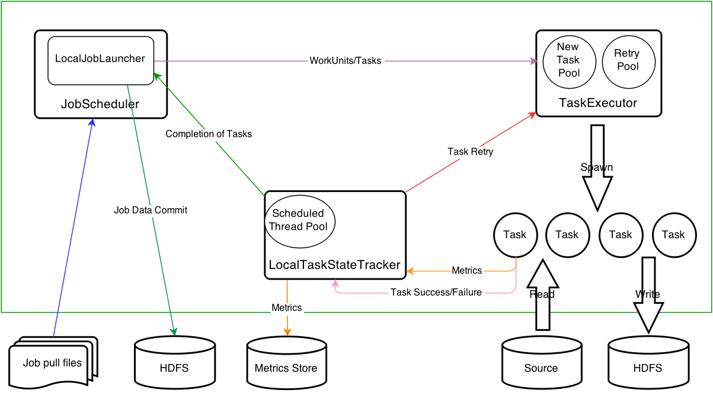

### Deployment Overview

Gobblin的重要特征之一就是能够运行在不同的平台。目前，Gobblin可以在standalone模式(在单台机器上运行)，和在Hadoop
MapReduce模式(运行在Hadoop集群)。接下来要介绍这两种不同的部署模式，理解这两种模式的结构很重要。

Gobblin支持java7或者更高的版本，但是只能运行在Hadoop2.x版本。默认支持Hadoop2.x版本。

### Standalone Architecture

下面的图展示了Standalone模式下的架构，在Standalone模式下，Gobblin的实例运行在单个的JVM里面，task运行在一个大小可以配置的线程池中。Standalone模式对于小型的数据库和轻量data
source很适合。同时Standalone模式也是默认用来尝试和测试Gobblin的模式。



在Standalone模式下，`JobScheduler`作为守护进程调度并运行jobs。`JobScheduler`为每一个运行job而开启的`JobScheduler`维持一个线程池。Gobblin有两个类型的`JobScheduler`，即`LocalJobLauncher`和`MRJobLauncher`。根据名字来，一个运行在单台机器，一个运行在Hadoop集群。

每一个`LocalJobLauncher`启动并管理几个组件来执行Gobblin
job的每个task。确切的，`TaskExecutor`负责在一个大小可配置的线程池中执行task。`LocalTaskStateTracker`负责记录运行的task的状态以及ypdate
the task metrics。`LocalJobLauncher`按照一下步骤来运行Gobblin job:
1.启动`TaskExecutor`和`LocalTaskStateTracker`。
2.根据指定的job配置创建一个`Source`实例，然后得到一个要去执行的`WorkUnit`表
3.为每一个`WorkUnit`创建一个task，通过`LocalTaskStateTracker`注册之后，把task提交给`TaskExecutor`运行。
4.等待所有提交的task完成
5.上面的东西都完成了之后，收集task的state然后把它们存放在state
store。把extracted data打印。

### Standalone Deployment

Gobblin有一个脚本`bin/gobblin-standalone.sh`用来启动和终止Gobblin单节点模式的守护进程。
下面是这个脚本的用法:
```shell
gobblin-standalone.sh <start | status | restart | stop> [OPTION]
Where:
  --workdir <job work dir>                       Gobblin's base work directory: if not set, taken from ${GOBBLIN_WORK_DIR}
  --jars <comma-separated list of job jars>      Job jar(s): if not set, lib is examined
  --conf <directory of job configuration files>  Directory of job configuration files: if not set, taken from 
  --help                                         Display this help and exit
```
在Standalone模式下，`JobScheduler`会在开始的时候到用户指定的目录下找到job配置文件然后调度job运行。job配置文件的目录可通过`bin/gobblin-standalone.sh`的命令行选项`--conf`来指定。或者通过设置环境变量`GOBBLIN_JOB_CONFIG_DIR`。`--conf`会被优先选择，如果没有指定的话，会选择`GOBBLIN_JOB_CONFIG_DIR`的值。
> Note that this job configuration directory is different from conf, which stores Gobblin system configuration files, in which deployment-specific configuration properties applicable to all jobs are stored. In comparison, job configuration files store job-specific configuration properties such as the Source and Converter classes used.

`JobScheduler`由[Quartz](http://quartz-scheduler.org/)支持，它可以通过属性`job.schedule`定义cron
schedule来支持cron-based triggers。这里有个[tutorial](http://quartz-scheduler.org/documentation/quartz-2.2.x/tutorials/tutorial-lesson-06)。

Gobblin在运行时需要一个工作目录，可以通过`bin/gobblin-standalone.sh`的命令行选项`--workdir`或者环境变量`GOBBLIN_WORK_DIR`来设置这个工作目录。`--workdir`会被优先考虑，如果没有设置的话会取`GOBBLIN_WORK_DIR`的值。启动之后，Gobblin会在工作目录下面创建几个目录:
```shell
GOBBLIN_WORK_DIR\
    task-staging\ # Staging area where data pulled by individual tasks lands
    task-output\  # Output area where data pulled by individual tasks lands
    job-output\   # Final output area of data pulled by jobs
    state-store\  # Persisted job/task state store
    metrics\      # Metrics store (in the form of metric log files), one subdirectory per job.
```
在运行Gobblin
standalone守护进程之前，确保`JAVA_HOME`环境变量已经被正确设置了。当启动Gobblin
standalone守护进程的JVM进程的时候，默认的jar包在`classpath`下，如果Gobblin
job需要其他额外的jar包的话，以逗号分隔跟在`bin/gobblin-standalone.sh`选项`--jars`后面。如果`--jar`没有设置的话，`lib`下的包会被包含。
以下是一些standalone模式下需要设置的环境变量:
+ `GOBBLIN_JOB_CONFIG_DIR`:定义job配置文件存储的地方
+ `GOBBLIN_WORK_DIR`:定义Gobblin操作的工作目录
+ `JAVA_HOME`

用下面的命令启动Gobblin standalone 守护进程:

`bin/gobblin-standalone.sh start [OPTION]`

Gobblin守护进程启动后，在`logs`文件夹下可以找到日志，Gobblin使用[SLF4J](http://www.slf4j.org/)和[slf4j-log4j12](http://mvnrepository.com/artifact/org.slf4j/slf4j-log4j12)。[log4j](http://logging.apache.org/log4j/1.2/)的配置可以在`conf/log4j-standalone.xml`中找到。

默认的话,Gobblin
standalone守护进程使用下面的JVM设置。如果有必要的话，可以再`bin/gobblin-standalone.sh`下修改这些设置。
```shell
-Xmx2g -Xms1g
-XX:+UseConcMarkSweepGC -XX:+UseParNewGC
-XX:+PrintGCDetails -XX:+PrintGCDateStamps -XX:+PrintTenuringDistribution
-XX:+UseCompressedOops
-XX:+HeapDumpOnOutOfMemoryError -XX:HeapDumpPath=<gobblin log dir>
```
使用下面不同的选项进行不同的操作:
```shell
bin/gobblin-standalone.sh restart [OPTION]

bin/gobblin-standalone.sh stop

bin/gobblin-standalone.sh status
```

### Hadoop MapReduce Deployment

Gobblin对于在Hadoop
MapReduce上运行job也有一个脚本`bin/gobblin-mapreduce.sh`,下面是运行脚本的用法:
```shell
Usage: gobblin-mapreduce.sh [OPTION] --conf <job configuration file>
Where OPTION can be:
  --jt <job tracker / resource manager URL>      Job submission URL: if not set, taken from ${HADOOP_HOME}/conf
  --fs <file system URL>                         Target file system: if not set, taken from ${HADOOP_HOME}/conf
  --jars <comma-separated list of job jars>      Job jar(s): if not set, lib is examined
  --workdir <job work dir>                       Gobblin's base work directory: if not set, taken from ${GOBBLIN_WORK_DIR}
  --projectversion <version>                     Gobblin version to be used. If set, overrides the distribution build version
  --logdir <log dir>                             Gobblin's log directory: if not set, taken from ${GOBBLIN_LOG_DIR} if present. Otherwise ./logs is used
  --help                                         Display this help and exit
```

假设你已经安装好并运行了Hadoop(both MapReduce and HDFS)。在Hadoop
MapReduce上运行Gobblin
jobs之前，检查Gobblin系统配置文件位于`conf/gobblin-mapreduce.properties`的属性`fs.uri`。这个属性定义了使用的文件系统uri。默认值是`hdfs://localhost:8020`，指向位于本地端口8020的本地HDFS。把它修改成你自己的HDFS。像这样比如在9000端口:

`fs.uri=hdfs://<namenode host name>:9000/`

和之前的其他属性一样，优先考虑`--fs`的值。如果在命令中设置了的话。

所有的job data和persisted job/task
states会被写在特定的文件系统里。在运行任何jobs之前。确保环境变量`HADOOP_BIN_DIR`被设置成指向Hadoop安装目录下的bin目录。和standalone模式一样，Hadoop
MapReduce部署时也需要工作目录，可以通过命令`bin/gobblin-mapreduce.sh`的选项`--workdir`或者环境变量`GOBBLIN_WORK_DIR`来指定。
> This setup will have the minimum set of jars Gobblin needs to run the job added to the Hadoop DistributedCache for use in the mappers.

如果job需要额外的jar包，那么可以通过命令`bin/gobblin-mapreduce.sh`的选项`--jars`来设置，或者通过job配置文件的属性来修改:

`job.jars=<comma-separated list of jars the job depends on>`

`--logdir`参数控制日志文件写在哪个文件夹，如果没有设置的话，日志文件写在`./logs`下。
> The `--projectversion` controls which version of the Gobblin jars to look for. Typically, this value is dynamically set during the build process. Users should use the `bin/gobblin-mapreduce.sh` script that is copied into the  `gobblin-distribution-[project-version].tar.gz` file. This version of the script has the project version already set, in which case users do not need to specify the `--projectversion` parameter. If users want to use the  `gobblin/bin/gobblin-mapreduce.sh` script they have to specify this parameter.
