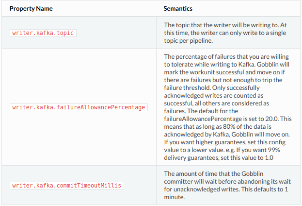

### Introduction
Kafka writer允许用户建造管道来从Gobblin sources中摄取数据到Kafka里面。This also enables Gobblin users to seamlessly transition their pipelines from ingesting directly to HDFS to ingesting into Kafka first, and then ingesting from Kafka to HDFS.

### Pre-requisites

+ 接下来的指导假定你对运行Gobblin有一定程度的了解，如果不是这样的话，请先了解了[Getting Started](http://gobblin.readthedocs.io/en/latest/Getting-Started/)再继续看下面的内容。

+ 在你开始使用Kafka writer之前，你先要设置写入的Kafka集群。在这里了解更多信息:[Apache Kafka quickstart guide](http://kafka.apache.org/documentation.html#quickstart)。

### Steps

+ 编辑[wikipedia-kafka.pull](https://github.com/linkedin/gobblin/blob/master/gobblin-example/src/main/resources/wikipedia-kafka.pull)，设置摄入到Kafka。这和管道[wikipedia.pull](https://github.com/linkedin/gobblin/blob/master/gobblin-example/src/main/resources/wikipedia.pull)例子很相似，这个例子拉取wikipedia的5个标题到HDFS。它们的不同之处在这些地方:

    + 设置`writer.builder.class`为`gobblin.kafka.writer.KafkaDataWriterBuilder`，这个类创建一个Kafka writer。

    + 设置`writer.kafka.topic`为`WikipediaExample`。这个topic是writer写record的地方。

    + 设置`writer.kafka.producerConfig.bootstrap.servers`为`localhost:9092`。这是writer必须要写的Kafka broker的地址。

    + partitioner类没有被指定，Kafka writer的实现不支持划分，所以会使用默认的Kafka partitioner。

    + 设置`data.publisher.type`为`gobblin.publisher.NoopPublisher`，这是因为Kafka不支持transactional语义，so it isn't possible to have a separate publish step to finally commit the data.

    + There is configuration for setting up the Schema Registry and Serializers that you will be using to write the data to Kafka. If you're using the Apache Kafka distribution, this file should work out of the box.

    + If you're using the Confluent distribution and want to use the Confluent schema registry, comment out the Local Schema Registry section and un-comment the Confluent schema registry section. The result should match the text below for Confluent users.
    
        ```shell

        #Confluent Schema Registry and serializers
        writer.kafka.producerConfig.value.serializer=io.confluent.kafka.serializers.KafkaAvroSerializer
        writer.kafka.producerConfig.key.serializer=io.confluent.kafka.serializers.KafkaAvroSerializer
        writer.kafka.producerConfig.schema.registry.url=http://localhost:8081  #Set this to the correct schema-reg url

        ##Use Local Schema Registry and serializers
        #writer.kafka.producerConfig.value.serializer=org.apache.gobblin.kafka.serialize.LiAvroSerializer
        #writer.kafka.producerConfig.kafka.schemaRegistry.class=org.apache.gobblin.kafka.schemareg.ConfigDrivenMd5SchemaRegistry
        #writer.kafka.producerConfig.schemaRegistry.schema.name=WikipediaExample
        #writer.kafka.producerConfig.schemaRegistry.schema.value={"namespace": "example.wikipedia.avro","type": "record","name": "WikipediaArticle","fields": [{"name": "pageid", "type": ["double", "null"]},{"name": "title", "type": ["string", "null"]},{"name": "user", "type": ["string", "null"]},{"name": "anon", "type": ["string", "null"]},{"name": "userid",  "type": ["double", "null"]},{"name": "timestamp", "type": ["string", "null"]},{"name": "size",  "type": ["double", "null"]},{"name": "contentformat",  "type": ["string", "null"]},{"name": "contentmodel",  "type": ["string", "null"]},{"name": "content", "type": ["string", "null"]}]}

        ```
+ 保存wikipedia-kafka.pull，运行standalone模式，在log里面你会看到类似的打印:

```shell
INFO  [TaskExecutor-0] gobblin.example.wikipedia.WikipediaExtractor  243 - 5 record(s) retrieved for title LinkedIn
INFO  [TaskExecutor-0] gobblin.example.wikipedia.WikipediaExtractor  243 - 5 record(s) retrieved for title Parris_Cues
INFO  [TaskExecutor-0] gobblin.example.wikipedia.WikipediaExtractor  243 - 5 record(s) retrieved for title Barbara_Corcoran
INFO  [TaskExecutor-0] gobblin.runtime.Task  176 - Extracted 20 data records
INFO  [TaskExecutor-0] gobblin.runtime.Task  177 - Row quality checker finished with results:
INFO  [TaskExecutor-0] gobblin.publisher.TaskPublisher  43 - All components finished successfully, checking quality tests
INFO  [TaskExecutor-0] gobblin.publisher.TaskPublisher  45 - All required test passed for this task passed.
INFO  [TaskExecutor-0] gobblin.publisher.TaskPublisher  47 - Cleanup for task publisher executed successfully.
INFO  [TaskExecutor-0] gobblin.runtime.Fork  261 - Committing data for fork 0 of task task_PullFromWikipediaToKafka_1472246706122_0
INFO  [TaskExecutor-0] gobblin.kafka.writer.KafkaDataWriter  211 - Successfully committed 20 records.
```
不过我这里的日志中是没有看到这样的信息,我的日志中看到的部分信息如下:
```text
2018-05-23 21:52:15 CST INFO  [JobScheduler-0] gobblin.example.wikipedia.WikipediaExtractor  396 - 1 record(s) retrieved for title Wikipedia:Sandbox
2018-05-23 21:52:15 CST INFO  [JobScheduler-0] gobblin.example.wikipedia.WikipediaExtractor  228 - Will pull revisions 842576932 to 842576932 for page Wikipedia:Sandbox.
2018-05-23 21:52:15 CST INFO  [JobScheduler-0] gobblin.runtime.TaskExecutor  159 - Executing task task_PullFromWikipediaToKafka_1527083532388_0
2018-05-23 21:52:15 CST INFO  [JobScheduler-0] gobblin.runtime.GobblinMultiTaskAttempt  134 - Waiting for submitted tasks of job job_PullFromWikipediaToKafka_1527083532388 to complete in container ...
2018-05-23 21:52:15 CST INFO  [JobScheduler-0] gobblin.runtime.GobblinMultiTaskAttempt  137 - 1 out of 1 tasks of job job_PullFromWikipediaToKafka_1527083532388 are running in container 
2018-05-23 21:52:15 CST INFO  [TaskExecutor-0] gobblin.runtime.TaskExecutor  191 - Submitting fork 0 of task task_PullFromWikipediaToKafka_1527083532388_0
2018-05-23 21:52:15 CST INFO  [TaskExecutor-0] gobblin.runtime.Task  392 - Extracted 0 data records
2018-05-23 21:52:15 CST INFO  [TaskExecutor-0] gobblin.runtime.Task  393 - Row quality checker finished with results: 
2018-05-23 21:52:15 CST INFO  [TaskExecutor-0] gobblin.runtime.Task  411 - Task shutdown: Fork future reaped in 0 millis
2018-05-23 21:52:15 CST INFO  [JobScheduler-0] gobblin.runtime.GobblinMultiTaskAttempt  143 - All assigned tasks of job job_PullFromWikipediaToKafka_1527083532388 have completed in container 
2018-05-23 21:52:15 CST INFO  [JobScheduler-0] gobblin.runtime.GobblinMultiTaskAttempt  329 - Will commit tasks directly.
2018-05-23 21:52:15 CST INFO  [Task-committing-pool-0] gobblin.publisher.TaskPublisher  48 - All components finished successfully, checking quality tests
2018-05-23 21:52:15 CST INFO  [Task-committing-pool-0] gobblin.publisher.TaskPublisher  50 - All required test passed for this task passed.
2018-05-23 21:52:15 CST INFO  [Task-committing-pool-0] gobblin.publisher.TaskPublisher  52 - Cleanup for task publisher executed successfully.
2018-05-23 21:52:15 CST INFO  [Task-committing-pool-0] gobblin.runtime.fork.Fork  287 - Committing data for fork 0 of task task_PullFromWikipediaToKafka_1527083532388_0
2018-05-23 21:52:15 CST INFO  [Task-committing-pool-0] gobblin.runtime.Task  478 - publish.data.at.job.level is true. Will publish data at the job level.
2018-05-23 21:52:15 CST INFO  [Task-committing-pool-0] gobblin.runtime.JobContext  374 - 1 more tasks of job job_PullFromWikipediaToKafka_1527083532388 have completed
2018-05-23 21:52:15 CST INFO  [Task-committing-pool-0] gobblin.runtime.local.LocalTaskStateTracker  128 - Task task_PullFromWikipediaToKafka_1527083532388_0 completed in 82ms with state SUCCESSFUL
2018-05-23 21:52:15 CST INFO  [JobScheduler-0] gobblin.util.ExecutorsUtils  186 - Attempting to shutdown ExecutorService: com.google.common.util.concurrent.MoreExecutors$ListeningDecorator@4d04d04a
2018-05-23 21:52:15 CST INFO  [JobScheduler-0] gobblin.util.ExecutorsUtils  205 - Successfully shutdown ExecutorService: com.google.common.util.concurrent.MoreExecutors$ListeningDecorator@4d04d04a
2018-05-23 21:52:15 CST INFO  [JobScheduler-0] gobblin.runtime.GobblinMultiTaskAttempt  212 - Task state store does not exist.
2018-05-23 21:52:15 CST INFO  [JobScheduler-0] gobblin.runtime.local.LocalJobLauncher  155 - All tasks of job job_PullFromWikipediaToKafka_1527083532388 have completed
2018-05-23 21:52:15 CST INFO  [JobScheduler-0] gobblin.runtime.JobContext  417 - Persisting dataset urns.
2018-05-23 21:52:15 CST INFO  [JobScheduler-0] gobblin.util.reflection.GobblinConstructorUtils  86 - Found accessible constructor for class class gobblin.metastore.nameParser.SimpleDatasetUrnStateStoreNameParser with parameter types [].
2018-05-23 21:52:15 CST INFO  [Commit-thread-0] gobblin.runtime.SafeDatasetCommit  104 - Committing dataset Wikipedia:Sandbox of job job_PullFromWikipediaToKafka_1527083532388 with commit policy COMMIT_ON_FULL_SUCCESS and state SUCCESSFUL
2018-05-23 21:52:15 CST INFO  [Commit-thread-0] gobblin.publisher.NoopPublisher  61 - Marking state committed
2018-05-23 21:52:15 CST INFO  [Commit-thread-0] gobblin.runtime.SafeDatasetCommit  335 - Persisting dataset state for dataset Wikipedia:Sandbox
2018-05-23 21:52:15 CST INFO  [Commit-thread-0] gobblin.runtime.FsDatasetStateStore  357 - Persisting Wikipedia.Sandbox-job_PullFromWikipediaToKafka_1527083532388.jst to the job state store
2018-05-23 21:52:15 CST INFO  [Commit-thread-0] org.apache.hadoop.io.compress.CodecPool  151 - Got brand-new compressor [.deflate]
```

看这样子可能是没有成功，日志里只看到提取了0条数据。

我又重新运行了一遍，这次在日志中看到了正确的输出:
```text
2018-05-24 19:52:10 CST INFO  [TaskExecutor-0] gobblin.example.wikipedia.WikipediaExtractor  396 - 6 record(s) retrieved for title Wikipedia:Sandbox
2018-05-24 19:52:11 CST WARN  [TaskExecutor-0] org.apache.http.client.protocol.ResponseProcessCookies  129 - Invalid cookie header: "Set-Cookie: WMF-Last-Access=24-May-2018;Path=/;HttpOnly;secure;Expires=Mon, 25 Jun 2018 00:00:00 GMT". Invalid 'expires' attribute: Mon, 25 Jun 2018 00:00:00 GMT
2018-05-24 19:52:11 CST WARN  [TaskExecutor-0] org.apache.http.client.protocol.ResponseProcessCookies  129 - Invalid cookie header: "Set-Cookie: WMF-Last-Access-Global=24-May-2018;Path=/;Domain=.wikipedia.org;HttpOnly;secure;Expires=Mon, 25 Jun 2018 00:00:00 GMT". Invalid 'expires' attribute: Mon, 25 Jun 2018 00:00:00 GMT
2018-05-24 19:52:11 CST INFO  [TaskExecutor-0] gobblin.example.wikipedia.WikipediaExtractor  396 - 3 record(s) retrieved for title Wikipedia:Sandbox
2018-05-24 19:52:11 CST INFO  [TaskExecutor-0] gobblin.runtime.Task  392 - Extracted 32 data records
2018-05-24 19:52:11 CST INFO  [TaskExecutor-0] gobblin.runtime.Task  393 - Row quality checker finished with results: 
2018-05-24 19:52:11 CST INFO  [TaskExecutor-0] gobblin.runtime.Task  411 - Task shutdown: Fork future reaped in 2 millis
2018-05-24 19:52:11 CST INFO  [JobScheduler-0] gobblin.runtime.GobblinMultiTaskAttempt  143 - All assigned tasks of job job_PullFromWikipediaToKafka_1527162724282 have completed in container 
2018-05-24 19:52:11 CST INFO  [JobScheduler-0] gobblin.runtime.GobblinMultiTaskAttempt  329 - Will commit tasks directly.
2018-05-24 19:52:11 CST INFO  [Task-committing-pool-0] gobblin.publisher.TaskPublisher  48 - All components finished successfully, checking quality tests
2018-05-24 19:52:11 CST INFO  [Task-committing-pool-0] gobblin.publisher.TaskPublisher  50 - All required test passed for this task passed.
2018-05-24 19:52:11 CST INFO  [Task-committing-pool-0] gobblin.publisher.TaskPublisher  52 - Cleanup for task publisher executed successfully.
2018-05-24 19:52:11 CST INFO  [Task-committing-pool-0] gobblin.runtime.fork.Fork  287 - Committing data for fork 0 of task task_PullFromWikipediaToKafka_1527162724282_0
2018-05-24 19:52:11 CST INFO  [Task-committing-pool-0] gobblin.writer.AsyncWriterManager  444 - Commit called, will wait for commitTimeout : 60000 ms
2018-05-24 19:52:11 CST INFO  [Task-committing-pool-0] gobblin.writer.AsyncWriterManager  485 - Successfully committed 32 records.
```

+ 要验证records是否确实被摄取到了kafka里面，可以运行kafka的消费者，就可以看到相应的信息打印在控制台上，我这里运行了kafka的消费者，在控制台确实打印了，只不过有些是乱码。另外还有一个验证的方法，我没看懂。or run Gobblin's [kafka-console pull file](https://github.com/linkedin/gobblin/blob/master/gobblin-example/src/main/resources/wikipedia-kafka.pull) which prints the events from Kafka onto the console.

### Configuration Details

Kafka writer支持所有[0.8.2 Java Kafka Producer](http://kafka.apache.org/082/javadoc/index.html?org/apache/kafka/clients/producer/KafkaProducer.html)支持的配置参数。你所要做的就是给每个producer支持的配置属性加上前缀`writer.kafka.producerConfig.`。比如，如果你想设置`acks`的参数为`all`，以确保完全确认写入，在pull文件里要这样设置`writer.kafka.producerConfig.acks=all`。在[official documentation](http://kafka.apache.org/082/documentation.html#newproducerconfigs)可以看到所有producer支持的配置属性。注意，目前gobblin是针对Kafka 0.8.2构建的，配置选项适用于新的0.8.2 java producer。

下面是几个可以控制gobblin的data writer的行为的关键参数:



### What Next?

接下来，只要在你的pull文件里正确的设置writer配置，你就可以把你的source导入到Kafka里面了。Happy Ingesting!

>译自[Record Sinks » Kafka](http://gobblin.readthedocs.io/en/latest/sinks/Kafka/)

