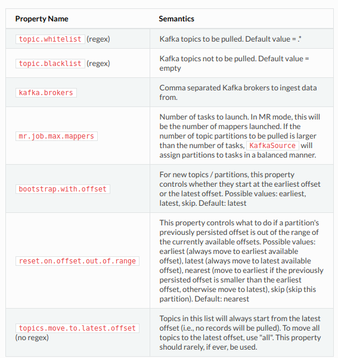

### Getting Started

这部分帮助你建立一个在单机上摄取Kafka
topics快速上手的job。我们同样提供了standalone和Mapreduce模式下的快速上手的例子。

### Standalone

+ 按照[Kafka quick start guide](http://kafka.apache.org/documentation.html#quickstart)建立一个单节点的Kafka broker。假定你的broker URI是`localhost:9092`，并且你还创建了一个含有两个事件:"This is a message"，"This is a another message"的topic----->"test"。

+ 接下里的步骤和[Wikipedia example](http://gobblin.readthedocs.io/en/latest/Getting-Started)一样，除了要使用下面的job配置属性:

```shell
job.name=GobblinKafkaQuickStart
job.group=GobblinKafka
job.description=Gobblin quick start job for Kafka
job.lock.enabled=false

kafka.brokers=localhost:9092

source.class=org.apache.gobblin.source.extractor.extract.kafka.KafkaSimpleSource
extract.namespace=org.apache.gobblin.extract.kafka

writer.builder.class=org.apache.gobblin.writer.SimpleDataWriterBuilder
writer.file.path.type=tablename
writer.destination.type=HDFS
writer.output.format=txt

data.publisher.type=org.apache.gobblin.publisher.BaseDataPublisher

mr.job.max.mappers=1

metrics.reporting.file.enabled=true
metrics.log.dir=${env:GOBBLIN_WORK_DIR}/metrics
metrics.reporting.file.suffix=txt

bootstrap.with.offset=earliest
```

job运行完成后，在`GOBBLIN_WORK_DIR/job-output/test`下能够看到刚才Kafka broker里写的两条消息。在`GOBBLIN_WORK_DIR/metrics`会存有这次运行收集的metrics，我这里运行的时候没有在`GOBBLIN_WORK_DIR`下看到这个文件夹。

在这里就先不运行集群的例子了，因为没有条件嘛，先运行个单节点的看看怎么回事，集群的就差不多一样的。

### Job Constructs

#### Source and Extractor

gobblin 提供了两个抽象类，`KafkaSource`和`KafkaExtractor`。`KafkaSource`为每个要pull的topic创建一个workunit，然后再根据`mr.job.max.mappers`属性指定的期望的workunit的数量把这些workunit合并并且分组。`KafkaExtractor`根据指定的`low watermark`和`high watermark`，提取分配到一个workunit上的partition数据。

为了在Kafka-HDFS摄取的job中使用它们，其中一点就是要继承`KafkaExtractor`，然后实现`decodeRecord(MessageAndOffset)`方法，这个方法把一个从Kafka broker拿出的`MessageAndOffset` object，解码成一个期望的object，另外一点就是继承`KafkaSource`，然后实现`getExtractor(WorkUnitState)`方法，该方法返回一个Extractor类的实例。

看一看下面几个类: `KafkaSimpleSource`，`KafkaSimpleExtractor`，`KafkaAvroExtractor`。

`KafkaSimpleExtractor`返回一个`MessageAndOffset` object的字节数组的payload，使用了`KafkaSimpleExtractor`的job可能要使用`Converter`来把字节数组转换成想要的格式。举个例子，如果想要的输出格式是JSON，那么就要实现一个`ByteArrayToJsonConverter`来把字节数组转换成JSON。另外，也还可以实现一个`KafkaJsonExtractor`，它继承自`KafkaExtractor`，然后把`MessageAndOffset` object在`decodeRecord`方法中转换成JSON object。两个方法都能很好的完成这项任务，`KafkaAvroExtractor`把`MessageAndOffset`解码成一个Avro `GenericRecord` object。

#### Writer and Publisher

任何一个期望的writer和publisher都能够使用。可以使用`AvroHdfsDataWriter`，`BaseDataPublisher`，如果想要文本输出的话，那么使用`SimpleDataWriter`。

#### Job Config Properties

下面一张图是`KafkaSource`和`KafkaExtractor`用到的一些job配置的属性



然后还可以为每个task设置一个时间限制，比如说限制15分钟，在job配置文件里这样写:

```shell
extract.limit.enabled=true
extract.limit.type=time #(other possible values: rate, count, pool)
extract.limit.timeLimit=15
extract.limit.timeLimitTimeunit=minutes
```
### Metrics and Events

#### Task Level Metrics

task level metrics 可以在`Extractor`，`Converter`和`Writer`通过扩展`InstrumentedExtractor`，`InstrumentedConverter`和`InstrumentedDataWriter`来实现。

比如，`KafkaExtractor`继承`InstrumentedExtractor`。你就可以在`KafkaExtractor`的子类中这样做:

```java
Counter decodingErrorCounter = this.getMetricContext().counter("num.of.decoding.errors");
decodingErrorCounter.inc();
```
Besides Counter, Meter and Histogram are also supported.

#### Task Level Events

Task level events可以通过创建一个`EventSubmitter`实例，使用`EventSubmitter.submit()`或者`EventSubmitter.getTimingEvent()`来提交。

#### Job Level Metrics

创建一个job level metrics，要继承`AbstractJobLauncher`，example:

```java
Optional<JobMetrics> jobMetrics = this.jobContext.getJobMetricsOptional();
if (!jobMetrics.isPresent()) {
  LOG.warn("job metrics is absent");
  return;
}
Counter recordsWrittenCounter = jobMetrics.get().getCounter("job.records.written");
recordsWrittenCounter.inc(value);
```
job level metrics通常是task level metrics的聚合，像上面`job.records.written`counter一样。因为`AbstractJobLauncher`不能够访问task level metrics，那就应该在`TaskState`中设置这些counter，重写`AbstractJobLauncher.postProcessTaskStates()`来把它们聚合起来。比如在`AvroHdfsTimePartitionedWriter.close()`，`writer.records.written`属性设置成`TaskState`。

#### Job Level Events

job level events可以通过扩展`AbstractJobLauncher`，然后使用`this.eventSubmitter.submit()`或者`this.eventSubmitter.getTimingEvent()`来创建。

更多有关metrics，events的细节，查看[gobblin metrics](http://gobblin.readthedocs.io/en/latest/metrics/Gobblin-Metrics/)部分。

### Grouping Workunit

对于每个要摄取的topic partition，`KafkaSource`首先会找到上一次运行拉取(pulled)的offset，也就是当前运行的第一个offset。(which should be the first offset of the current run)。它同样也会从kafka集群查找到最早的和最新的offset，然后验证当前这第一个offset是不是位于最早的offset和最新的offset之间。最新的offset就是当前workunit拉取的最新的offset。由于新的records会经常打印到kafka，旧的records会基于retention policies删除，所以在一个partition里面，最早的和最晚的offsets会经常改变。

对于每个partition，在最早的和最新的offset被确认了之后，就会创建一个workunit。如果kafka的partition数量超过了属性`mr.job.max.mappers`设置的期望的workunit的数量，`KafkaSource`会整合并分组成n个`MultiWorkUnit`。

`n = mr.job.max.mappers`

然后使用`KafkaWorkUnitPacker`，它有两个实现:`KafkaSingleLevelWorkUnitPacker`和`KafkaBiLevelWorkUnitPacker`。这些packer根据预计的每个workunit的大小打包workunit，预计的这块由`KafkaWorkUnitSizeEstimator`来处理，它有两个实现:`KafkaAvgRecordSizeBasedWorkUnitSizeEstimator`和`KafkaAvgRecordTimeBasedWorkUnitSizeEstimator`。

待续...


> 译自[Kafka-HDFS Ingestion](http://gobblin.readthedocs.io/en/latest/case-studies/Kafka-HDFS-Ingestion/)
