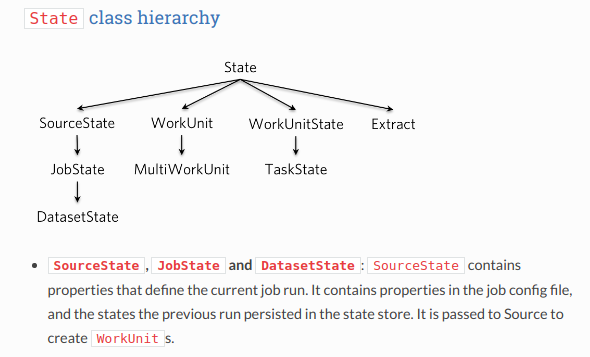
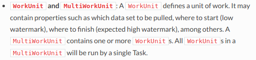

在看了gobblin一些例子的源码后，发现state和watermark很重要，但是我却知道得很少，所以决定看一看官方的文档，了解这两个东西。

主要分两个内容，一个是关于两个计划的ingestion job之间怎么样携带checkpoints，以便每次运行都能够从上次运行离开的地方运行。另外一个是探讨gobblin里面不同种类的state，以及怎样在典型的job里面使用它们。

### Managing Watermarks in a Job

当调度一批gobblin job运行时，拉取的data逐渐增长的时候，每次运行，在完成它的task的时候，应该把它的work的state存放在state store里面，以便下次运行的时候可以根据上次运行的state继续运行。这些靠一个称作`Watermark`的概念完成。

#### Basics

***low watermark and expected high watermark***

当`Source`创建一个`WorkUnit`的时候，每个`WorkUnit`应该通常包含一个low watermark和一个expected high watermark。它们是相应的task的起始点和终结点，并且task应该从low watermark拉取data到expected high watermark。

***actual high watermark***

当一个task完成提取data了，它就应该在它的`WorkUnitState`里写入实际的high watermark。于是，`Extractor`可能会维持一个`nextWatermark`field，在`Extractor.close()`里，调用`this.workUnitState.setActualHighWatermark(this.nextWatermark)`。如果task成功完成的话，实际的high watermark通常和expected high watermark是一样的。如果task失败了或者是超时了，那么会比expected high watermark小一点。在某些情况下，expected high watermark可能不可用，于是实际的high watermark就会成为告诉当前运行离开的唯一指标了。

在下一次运行的时候，`Source`会调用`SourceState.getPreviousWorkUnitStates()`，这里面包含了上次运行的实际high watermarks，然后被用来当作新的一次运行的low watermarks。

***watermark type***

通过实现`Watermark`接口，Watermark可以是任意自定义的类型。比如，对于Kafka-HDFS ingestion，如果如果每个`WorkUnit`只负责拉取一个Kafka topic partition，那么Watermark就是一个代表Kafka offset的`long`值，如果每个`WorkUnit`负责拉取多个Kafka topic partition，那么Watermark就是一个`long`值的列表，像`MultiLongWatermark`。

#### Task Failures

task拉取某些data的时候可能失败，如果task失败了，并且配置属性里，`job.commit.policy`设置成`full`，那么它刚才拉取的data不会被打印，在这种情况下，不管`Extractor.nextWatermark`的值如何，实际的high watermark会在gobblin内部自动回滚到low watermark。另一方面，如果commit policy设置成`partial`，失败的task会commit，然后data会被打印。在这种情况下，`Extractor`负责在`Extractor.close()`里设置正确的实际high watermark。因此，推荐`Extractor`每次拉取一个record之后就更新`nextWatermark`，这样`nextWatermark`就一直都是最新的状态。

#### Multi-Dataset Jobs

目前gobblin提供的唯一的state store的实现是`FsStateStore`，它利用Hadoop SequenceFiles 来存储state。默认情况下，每个job运行会读取上一个运行产生的SequenceFiles，然后生成新的SequenceFiles。当一个job从多个dateset拉取data的时候就会有个陷阱:如果一个data set在job运行的时候因为某种原因被跳过了，它的watermark会在下一次运行的时候不可用！

**Example**:假设我们调度了一个Gobblin job从Kafka broker拉取Kafka topic，有10个partition。在这种情况下，每个partition都是一个dataset。在运行的job中，一个partition由于黑名单或者其他的原因被略过了。如果这个partition没有创建一个`WorkUnit`，这个partition的watermark就不会在state store里被检查，然后就会在下一次运行的时候不可用。

有两种解决办法(还有第三种，就是你自己实现一个state store，它有不同的行为，就不会有这种问题)

**Solution 1**:确保为每个dataset创建一个`WorkUnit`，即使这个dataset应该被略过，也应该为它创建一个空的`WorkUnit`(空的`WorkUnit`意味着low watermark = expected high watermark)。

**Solution 2**:使用Dataset URN。当一个job拉取多个dataset的时候，`Source`要为每个dataset定义一个URN。比如，我们可以用`PageViewEvent.5`作为topic `PageViewEvent`的第5个partition的URN。当`Source`为这个partition创建`WorkUnit`的时候，它就应该在这个`WorkUnit`里设置属性`dataset.urn`的值为`PageViewEvent.5`。这个方法目前被gobblin用来支持job从多个dataset里拉取data。

如果不同的`WorkUnit`有不同的`dataset.urn`的值，job会为每个`dataset.urn`创建一个state store SequenceFiles。在下次运行的时候，不是调用`SourceState.getPreviousWorkUnitStates()`，而是使用`SourceState.getPreviousWorkUnitStatesByDatasetUrns()`。这样的话，每次运行会根据dataset去寻找最近的state store SequenceFiles。因此，即使一个dataset在job运行的时候没有处理，它的watermark也不会丢失。

注意在使用Dateset URN的时候，每个`WorkUnit`只能拥有一个`dataset.urn`，也就是说，比如在一个Kafka ingestion案例里面，每个`WorkUnit`只能处理一个partition。这通常不是一个大的问题，除了它可能会输出很多小文件(像在[Kafka HDFS ingestion](http://gobblin.readthedocs.io/en/latest/case-studies/Kafka-HDFS-Ingestion)，通过一个`WorkUnit`来从一个topic的多个partition里拉取data，三个partition可以共享一个输出文件)。另一方面，不同的`WorkUnit`可能有一样的`dataset.urn`。

### Gobblin State Deep Dive

Gobblin在job运行的时候涉及到几个state的类型，比如`JobState`，`TaskState`，`WorkUnit`，等等。他们都继承自`State`class，它封装了`Properties`，提供了一些有用的函数。

对比`SourceState`，`JobState`同样有job运行时的属性，比如job ID，starting time，end time等。同样还有job运行的状态，比如`PENDING`，`RUNNING`，`COMMITTED`，`FAILED`等。

当job拉取的data被分成不同的dataset的时候(根据使用上面的`dataset.urn`)，每个dataset在JobState里会有一个`DatasetState`object，并且每个会分别存储它的state。

