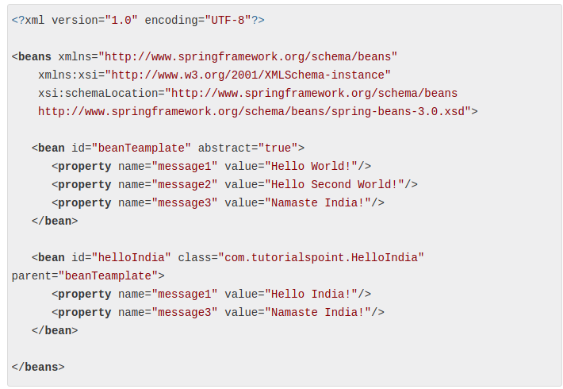

+ Spring通过依赖注入(DI)来管理组成一个应用程序的组件，这些对象被称为Spring Beans，Spring容器会创建对象，把它们链接在一起，配置它们，并且管理它们的整个生命周期。

+ Spring提供了两个不同类型容器: Spring BeanFactory和Spring ApplicationContext。BeanFactory是最简单的容器，比较轻量，提供了DI基本的支持。ApplicationContext能从属性文件解析文本信息，包含了BeanFactory的所有功能。

+ BeanFactory接口有一个实现就是XmlBeanFactory，它能从属性文件读取配置

+ 被称作 bean 的对象是构成应用程序的支柱也是由 Spring IoC 容器管理的。bean 是一个被实例化，组装，并通过 Spring IoC 容器所管理的对象。

### Bean的生命周期

+ Bean的作用域，当创建Bean的时候，属性scope设置为prototype，在每次创建Bean对象的时候，都会返回一个新的bean实例，属性scope设置为singleton，每次创建创建Bean对象的时候，返回同一个实例。

+ 在Bean的生命周期中，在Bean开始创建的时候和销毁的时候，可以调用自定义的void无参方法，注意在销毁一个Bean的时候，要使用AbstractApplicationContext类的registerShutdownHook()方法，它会确保正常关闭，并调用相关destroy方法

+ Bean的后置处理器，实现了BeanPostProcessor接口的Bean，会被注册为后置处理器，然后在容器中创建这个Bean(也就是说，在配置文件中要声明这个Bean)，然后会在适当的时候调用它，比如一个bean开始初始化和初始化完成的时候

### Bean的依赖

+ Bean定义继承，bean 定义可以包含很多的配置信息，包括构造函数的参数，属性值，容器的具体信息例如初始化方法，静态工厂方法名，等等。
子 bean 的定义继承父定义的配置数据。子定义可以根据需要重写一些值，或者添加其他值。

在xml文件中，通过设置bean的parent属性指定父类bean的id，完成继承这一操作

甚至可以定义一个模板的bean，设置abstract值为true，然后他就可以作为一个模板来供继承它的子类使用:

