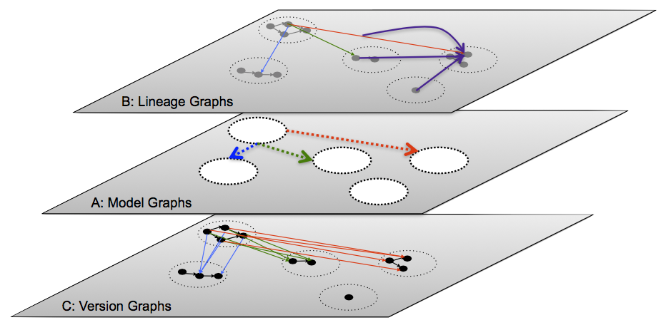

## Version Graphs

我们从Common Ground的Version graph开始，在数据上下文的ABC模型中，对应c这一层，用来捕捉变化

在我们的元模型(metamodel)中，最主要的元素就是Version，它是一个全局唯一标识符。

it(Version) represents an immutable version of some object.

在图中最下面一层，我们通过小圆圈来描述Version。

ground通过VersionSuccessor边来连接不同的Version形成VersionHistoryDAG，一个VersionHistoryDAG就是图中最下面一层中的一个个的虚线圆圈。这样的每一个圆圈里面画出了一个版本的到下一个版本的演化过程。

类型参数化确保在给出的DAG图(有向无环图)中的VersionSuccessors连接相同Version的子类。

注意，上面所说到的所有类都是不可变的，如果有新的值，就只能新创建一个Version。

在ground中这里提到是ground可以追踪不放在ground中的数据，比如github的仓库信息和google docs这样的在ground之外管理的数据，ground不能够在这些数据变化的时候追踪它们，但是它可以追踪它对这些数据的“观察”，它对数据的“观察”版本可以通过Ground的RichVersion的可选项来表示：比如访问的参数(端口号，协议，URI)，一个外部访问的时间戳，还有什么可选的cachedValue这类的，这些从侧面描述这次“观察”的数据。每当Ground的客户端通过aboveground API去访问一个外部参数不为空的RichVersion的时候，Ground就会获得这个外部的object，然后生成一个包含新VersionID的新的外部Version，我们称这种行为为`Schrödinger versioning scheme`:每当我们观察一个外部Version改变的时候，通过上面的操作，Ground就像追踪一个数据放在Ground中的数据一样。

---

## Model Graphs

这里大致意思应该是说这一层是ABC模型的A，通过使用graph model来表示数据模型，包括结构化的数据或者半结构化的数据。

A simple graph model enables the agility of schema-on-use at the metadata level, allowing diverse metadata to be independently captured as ad hoc model graphs and integrated as needed over time.

model graph基于一个内部超类:***Item***，它是一个可以和一个VersionHistoryDAG关联在一起的唯一ID。这里我想意思就是说一个VersionHistoryDAG就是一个Item。而一个VersionHistoryDAG可以说是描述了一个Item的版本变化。

Note that an Item is intrinsically immutable, but can capture change via its associated VersionHistoryDAG:a fresh Version of the Item is created whenever a Tag is changed.

Ground的公共API中心围绕着三个派生自Item的类:Node, Edge, Graph

上面的三个类都有着对应的Version的子类:NodeVersion, EdgeVersion, GraphVersion。

---

## Lineage Graphs
世系图，位于模型最上层

在看文档的时候发现有一句话，解释了Lineage的作用。
> For example, we might want to record that Sue imported nltk.py in her churn.py script; this is captured by a LineageEdge between a PrincipalVersion (representing Sue) and an EdgeVersion (representing the dependency between the two files).
