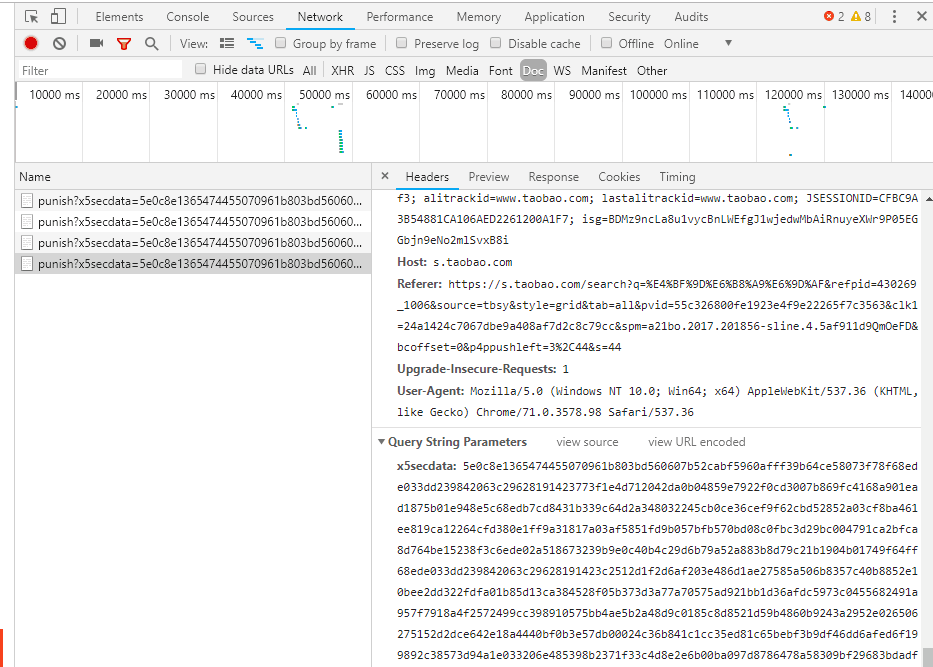
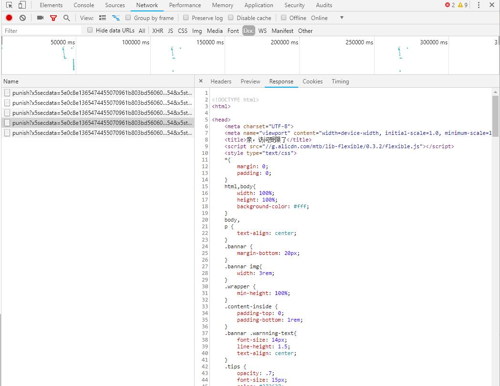
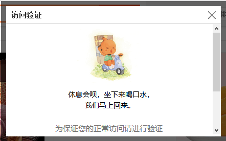
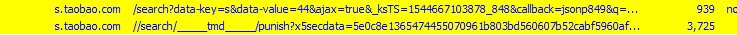

# 爬取淘宝商品页面

## 安装selenium

```shell
pip install selenium
```
安装完成后，打开终端，输入`python`，输入`import selenium`不报错的话，安装成功

## 安装firefox webdriver

安装浏览器的驱动，安装了这个，selenium才可以打开浏览器窗口，原来我安装的是chrome的webdriver，可是在使用fiddler抓包的时候，发现有些东西抓不了，然后就换成了firefox的webdriver。
下载[firefox webdriver](https://github.com/mozilla/geckodriver/releases)

## 安装chrome webdriver(可选)
。。。。


## 安装fiddler

用这个来抓包，可以在官网下载，

下载[fiddler](https://www.telerik.com/download/fiddler)

安装好后，启动fiddler，它会自动开启代理，当关闭fiddler的时候，它会自动关闭代理。

安装好后，要捕捉https的请求，还需要再设置一下，
参考这里:[如何用 fiddler 捕获 https 请求](https://www.cnblogs.com/zichi/p/4992885.html)

在这里了解如何替换文件:[fiddler本地代理替换js文件](https://blog.csdn.net/weixin_37615202/article/details/76228515)

## python代码

+ 在打开一个商品页后，会注意到，如果不滑动到底部的话，一些商品的信息是不会加载出来的，在`selenium`中，是可以执行js代码的。通过执行下面这行代码，可是滚动页面到底部:
    ```python
    driver.execute_script("window.scrollTo(0, document.body.scrollHeight);")
    ```

+ 使用lxml的时候，如果引入etree的时候报错没有:

    ```python
    from lxml import etree
    ```
    那么是因为新版本的引用方法改变了个方式
    ```python
    from lxml import html
    etree = html.etree
    ```

+ [学爬虫利器XPath,看这一篇就够了](https://zhuanlan.zhihu.com/p/29436838)


## chrome webdriver设置代理(可选)
```python
from selenium import webdriver
chrome_options = webdriver.ChromeOptions()
chrome_options.add_argument('--proxy-server=http://171.37.135.94:8123')
driver = webdriver.Chrome(chrome_options=chrome_options)
```

## firefox webdriver设置代理(可选)
```python
profile = webdriver.FirefoxProfile()
profile.set_preference('network.proxy.type', 1)
profile.set_preference('network.proxy.http', ip)
profile.set_preference('network.proxy.http_port', port)
profile.set_preference('network.proxy.ssl', ip)
profile.set_preference('network.proxy.ssl_port', port)
profile.set_preference('network.proxy.socks', ip)
profile.set_preference('network.proxy.socks_port', port)

profile.update_preferences()
driver = webdriver.Firefox(profile)
```


----

不能设置代理了，因为设置代理的话，fiddler会捕捉不到打开的浏览器的数据包，替换js文件也就不行了


现在遇到了淘宝的访问验证了，用代码把它关闭之后要跳转到下一页继续弹窗，一直循环，到不了下一页。
真人打开谷歌浏览器（代码用的火狐浏览器），访问淘宝的时候，点击下一页，也点击不了，也是弹窗访问验证。

可能ip被封了

然后我再浏览器打开network，查看是不是发送了些什么东西去验证我。
果不其然，在我每次点击下一页后，它就会发送一个名叫`punish?x5secdata=......`的文件，


然后收到的回应就是刚才的弹窗






----


我在fiddler里看到这些东西



上面一列是正常请求的，那么正常的会得到商品信息，可下面一个是紧接着被重定向发出的，然后就出现了弹窗验证

看样子，服务器已经把我记录在案了，有可能是账号，有可能是ip

我换个账号试试

换个账号就行了


